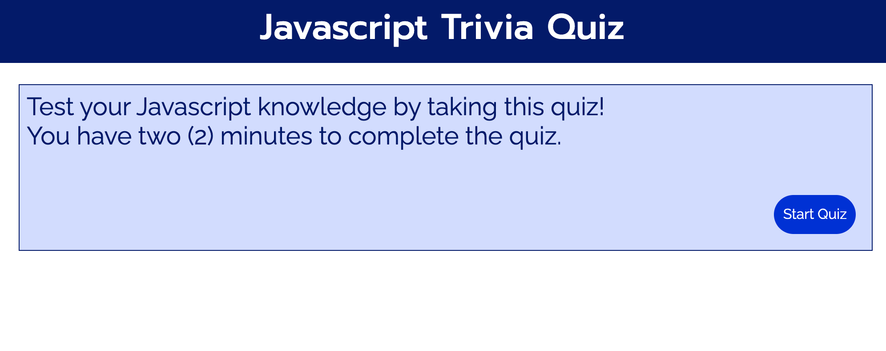
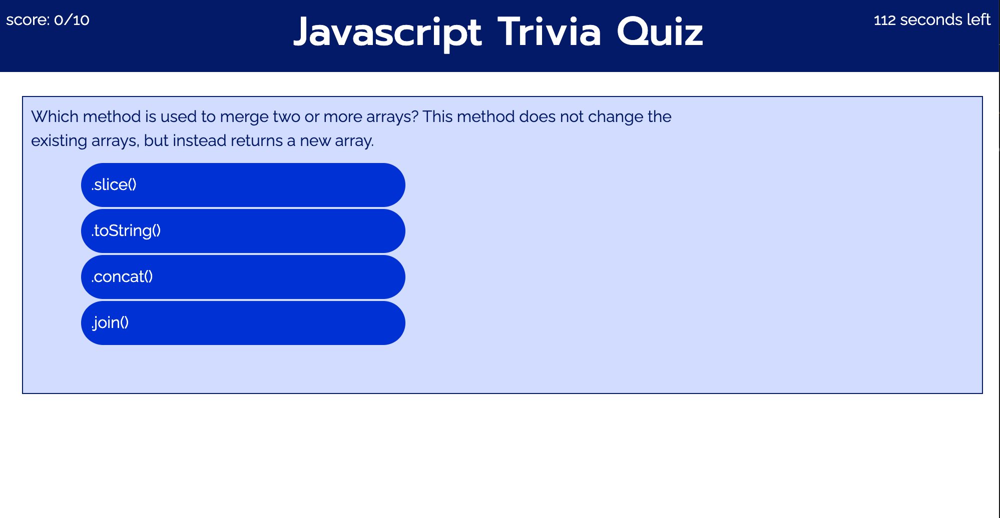
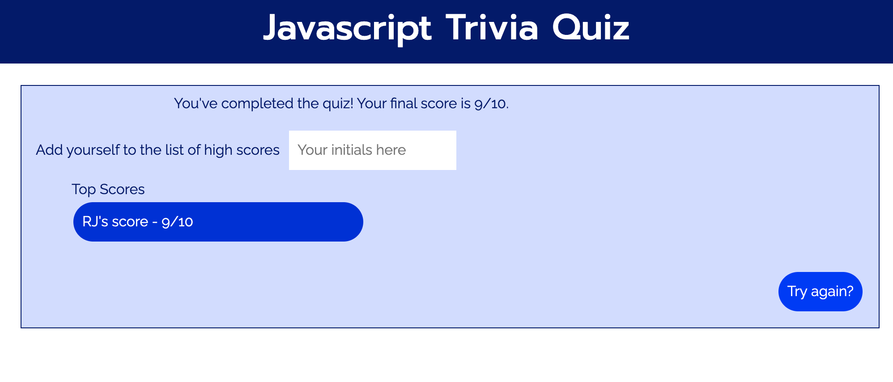

**Start Screen**
1. on start screen, there is a brief greeting followed by an active start button

**Quiz Questions**
1. array of quiz questions is randomized so that if user decides to repeat quiz, it will be different every time
1. a list of choices is generated from an array with active buttons
1. score progress and timer appear at the top of the screen
1. selection of the correct answer will increase score by 1
1. selection of the wrong answer will subtract 10 seconds from the clock
1. once user makes a selection, they will be automatically progressed to the next question

**End Quiz**
1. If time runs out before user goes thru array of questions, they will be given notification
1. If user completes the quiz before time runs out, they will be given notification, and also a chance to log their score
1. in either situation, score progress and timer will disappear, and try again button will appear at the bottom right so that user can play again

